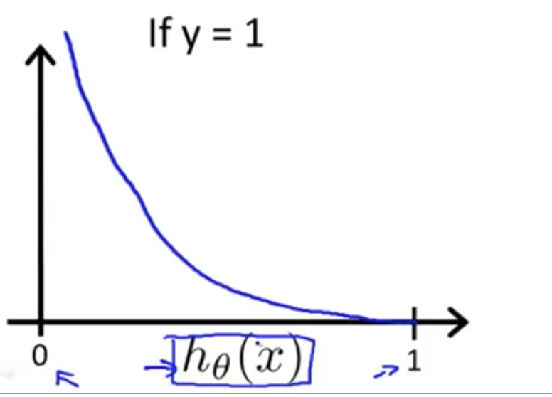

Things have been going pretty smoothly. Having a study buddy at work has been *enormously* helpful towards my learning. We get together for two hours a week during the workday just to study and code. Something about it really helps me engage with the material, even when we study in silence. I'll give him a shout-out on here one day if agrees with it someday.

I've decided to blog this a little bit more closely. Instead of thinking of blogging as a separate activity, I decided to write my thoughts down as I'm taking the course to help me process things in a more consolidated way. 
I've been on week three, focusing on classification and logistic regression. We want to use logistic regression instead of linear regression for a number of reasons. One of them is due to the many local optima involved with the linear regression cost function. The cost function of logistic regression is convex, giving you a nice, noticeable global minimum.


*Here's a screenshot of one of Prof Ng's logistic curves. My notes consist of a ton o' screenshots like this. Check that sweet, sweet convex curve.*

I've been also attacking the programming exercises earlier on. One thing I was working on last night was getting the cost function for the logistic regression exercises working. That cost function for one class (y = 0, or y = 1) looks like this;

Cost(ℎ𝜃(𝑥),𝑦)=−𝑦log(ℎ𝜃(𝑥))−(1−𝑦)log(1−ℎ𝜃(𝑥))


And the resulting octave code I used for that exercise looks like this:

```
# given X, y and features vector theta
hypothesis = sigmoid(X * theta);
J = (1/m)*(-y'* log(hypothesis) - (1 - y)'* log(1-hypothesis));
grad = (1/m)*X'*(hypothesis - y);
```
Where J is the cost we're looking for. My understanding of "cost" so far is that that's what we'll use to penalize our model in case of errors and is useful to the practitioner as the error rate can give a sense of the performance of the model.

I'm pretty excited for those next portions of the exercises tho. The name of the exercise is 'predict.m', I can only guess what's involved 😊😭.

One reason I'm excited is because, speaking of single-class classification and prediction - I've come up with an idea for a project ("uh oh").

I thought it would be fun to try to get together a dataset of images of parkour spots, train a (pre-trained object classification)model on it, and then use that model to classify parkour spots. If there's a miracle, and I get it working, it would be so cool to crawl the web for images, classify them, store the parkour spots and expose them in some fashion. We'll see how it goes I guess. for now, I've just been trying to gather images of parkour spots. I think that parkour spots are subjectively pretty recognizable to the human eye. They have a lot of verticality, and a lot of commmon shapes, such as wheelchair ramps. Due to these visual features, I'm curious whether object classification could here. We'll see.


*A pretty typical-looking parkour spot*

In any case, for starters I'm just gathering up images like the above in order to do training.